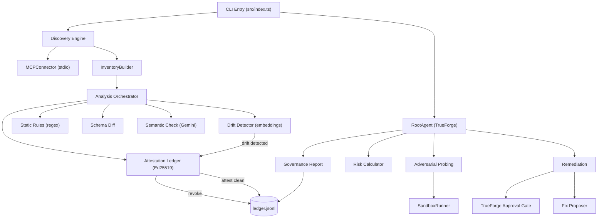

# 🛡️ Odezzy AI — MCP Security Red-Teaming Agent

> **Automated vulnerability discovery, adversarial probing, and cryptographic attestation for MCP (Model Context Protocol) tool servers.**

[](https://www.typescriptlang.org/)
[](https://nodejs.org/)
[](https://truefoundry.com/trueforge)

Odezzy AI is a security-focused agent that scans MCP servers for vulnerabilities across the [OWASP MCP Top 10](https://genai.owasp.org/), using a 4-pass analysis pipeline, adversarial probing, and a cryptographic attestation ledger that automatically revokes trust when tool definitions drift.

---

## ✨ Key Features

- **4-Pass Analysis Pipeline**: Static regex rules → Schema diff → Gemini semantic analysis → Embedding-based drift detection
- **Adversarial Probing**: 4 deterministic probe templates (undeclared-params, prompt-injection, secret-scan, schema-mismatch)
- **Cryptographic Attestation Ledger**: Ed25519-signed, hash-chained attestation records with automatic revocation on drift — the first implementation found that closes attestation and revocation into one loop
- **OWASP MCP Top 10 Mapping**: Every finding tagged with CWE ID and OWASP category
- **TrueForge Integration**: Remediation proposals gated through TrueForge's real tool-call approval mechanism
- **Risk Scoring**: Weighted severity × confidence scoring with A-F grading and color-coded risk bands
- **Governance Reports**: Markdown + JSON reports with attestation ledger section and public verification key

---

## 🏗️ Architecture



---

## 🚀 Quick Start

### Prerequisites
- Node.js ≥ 18
- A [Gemini API key](https://aistudio.google.com/apikey) (for semantic analysis and drift detection)
- [TrueForge](https://truefoundry.com/trueforge) (optional, for approval-gated remediation)

### Installation

```bash
git clone <repo-url>
cd odezzy-ai
npm install
```

### Configuration

1. Copy the environment template:
```bash
cp .env.example .env
```

2. Edit `.env` with your keys:
```
GEMINI_API_KEY=your-gemini-api-key
GCP_PROJECT_ID=your-project-id
TRUEFORGE_URL=http://localhost:8790
```

3. Edit `odezzy.config.json` to add your MCP servers:
```json
{
  "servers": [
    {
      "name": "my-mcp-server",
      "command": "npx",
      "args": ["tsx", "path/to/server.ts"]
    }
  ]
}
```

### Running

```bash
# Quick scan (static + schema + semantic + drift)
npm run scan

# Full scan with TrueForge approval gating
npm run fullscan

# Discovery only (list servers and tools)
npm run dev discover

# Run against the built-in vulnerable canary server
npm run canary   # Start canary in one terminal
npm run scan     # Run scan in another

# Run tests
npm test
```

---

## 🔏 Cryptographic Attestation Ledger

Odezzy AI doesn't just detect problems — it **certifies** tools that pass every check.

### How it works:
1. After all 4 analysis passes complete, tools with **zero findings** receive an Ed25519-signed attestation record
2. Records are hash-chained (each references the SHA-256 of the previous entry) — tamper-evident
3. When the drift detector catches a tool that changed meaning after being trusted, the attestation is **automatically revoked** in the same scan
4. The public key is included in governance reports for independent verification

### Attestation files:
```
.odezzy/attestation/
├── keys.json        # Ed25519 keypair (auto-generated on first run)
└── ledger.jsonl     # Append-only hash-chained attestation log
```

### Why this matters:
Every published paper on MCP attestation (as of 2026) treats it as static — sign once, verify against a frozen hash. Odezzy is the first implementation found that closes attestation and revocation into one automatic loop, using the drift detector to trigger revocations the instant a tool changes meaning.

---

## ⚙️ TrueForge Setup (Required for `fullscan`)

> [!IMPORTANT]
> This is a **one-time manual step** — confirmed not automatable via the SDK.

1. Open TrueForge UI at `http://localhost:8790`
2. Go to **Settings → Connectors**
3. Register an MCP server that exposes an `apply_fix(findingId: string)` tool
4. Set `requireApprovalForTools: ["@all"]` on this connector
5. Run `npm run fullscan` — remediation proposals will now pause for human approval in the TrueForge chat UI

Without this connector, `fullscan` still works but **fails closed** — all remediation proposals are treated as rejected rather than silently applied.

---

## 🧪 Testing

```bash
# Run all tests
npm test

# Run specific test suite
npx vitest run tests/attestation.test.ts

# Run with coverage
npx vitest run --coverage
```

### Test suites:
| Suite | Tests | Coverage |
|---|---|---|
| `types.test.ts` | 13 | Zod schema validation |
| `analysis.test.ts` | 6 | Static rules + schema diff |
| `drift-detector.test.ts` | 6 | Embedding drift detection |
| `probing.test.ts` | 9 | Probe templates + normalizer |
| `scoring.test.ts` | 9 | Risk formulas + classification |
| `canary.test.ts` | 8 | Integration against canary server |
| `agent.test.ts` | 2 | RootAgent lifecycle |
| `config.test.ts` | 6 | Config parsing + defaults |
| `attestation.test.ts` | 7 | Attestation ledger (attest, verify, revoke, chain) |
| `quarantine.test.ts` | 8 | Quarantine hash-chain, TOCTOU-safe attestation, approval-gated apply |
| `human-approval-token.test.ts` | 6 | Token factories + cross-finding rejection |
| `remediation-server.test.ts` | 4 | Real MCP subprocess for `apply_fix` |
| `server-approvals.test.ts` | 5 | HTTP API approval endpoints |

---

## 🚦 Build Health — what's actually enforced

Being specific about this on purpose: it's easy for "security review" in a
project like this to quietly mean "an AI left some comments," which is not
the same thing as "a bug like this cannot merge." Here's exactly which is
which.

**Enforced automatically, blocks the PR (`.github/workflows/ci.yml`):**
- `npm run typecheck` (`tsc --noEmit`) — this is what would have caught
  the bug where `tests/remediation-server/server.ts` called a
  `HumanApprovalToken` factory that didn't exist in the real
  implementation yet, automatically, the first time, instead of a human
  having to notice it during review. (Part of why that bug slipped
  through originally: the file lived outside `tsconfig.json`'s `include`
  path, so `tsc` was never even looking at it. It's since been moved to
  `remediation-server/` at the repo root, matching `tsconfig.json`,
  `package.json`'s `remediation-server` script, and the file's own setup
  instructions — see its header comment.)
- `npm test` (the full Vitest suite above) — also build-blocking.
- A grep-based check that any file calling `ApplyFix.apply()` also
  imports `HumanApprovalToken` — a lightweight, non-AST enforcement of
  "no caller can fake approval" as a CI gate, not just a type-system
  property a reviewer has to remember to check for.

**Also available, opt-in, not yet enforced by CI:**
- `.githooks/pre-commit` runs the same typecheck locally before a commit
  even happens. Enable it once per clone with
  `git config core.hooksPath .githooks`. This is a convenience layer in
  front of CI, not a replacement for it — CI is what actually blocks a
  PR; the hook just gives faster local feedback.

**Advisory only, does NOT block anything (`pr_agent.toml`):**
- `pr_reviewer` / `pr_code_suggestions` — an AI reviewer that leaves PR
  comments focused on security-critical paths, MCP tool schemas, type
  safety, and error handling. Useful for catching things a compiler
  can't (logic questions, missing edge cases, design concerns), but it
  cannot fail a build and a PR can merge with its comments unaddressed.

**Manual, human judgment only:**
- Whether a proposed remediation is actually safe to approve — that's
  the entire point of TrueForge's approval-gating (see below); no amount
  of CI replaces a human looking at a specific finding before it's
  quarantined.
- Cryptographic key custody for the attestation ledger's Ed25519 keypair
  (`.odezzy/attestation/keys.json`) — nothing automated rotates or
  protects this file today.

---

## 📁 Project Structure

```
odezzy-ai/
├── src/
│   ├── attestation/              # 🔏 Cryptographic attestation ledger
│   │   └── attestation-ledger.ts #    Ed25519 sign/verify/revoke, JSONL chain
│   ├── analysis/                 # 🔍 4-pass analysis pipeline
│   │   ├── index.ts              #    Orchestrator (static → schema → semantic → drift → attest)
│   │   ├── static-rules.ts       #    5 regex patterns (OWASP-mapped)
│   │   ├── schema-diff.ts        #    Static + runtime schema validation
│   │   ├── semantic-check.ts     #    Gemini 2.5 Flash semantic review
│   │   └── drift-detector.ts     #    Embedding-based rug-pull detection
│   ├── agent/                    # 🤖 TrueForge agent integration
│   │   ├── root-agent.ts         #    Full pipeline orchestrator
│   │   ├── subagent.ts           #    Adversarial probe fan-out
│   │   └── trueforge-client.ts   #    SDK wrapper (sessions, turns, approvals)
│   ├── config/                   # ⚙️  Configuration
│   │   └── parser.ts             #    Env + JSON merge with Zod validation
│   ├── discovery/                # 🔌 MCP server discovery
│   │   ├── mcp-connector.ts      #    Stdio transport client
│   │   ├── inventory.ts          #    Concurrent scanner with retry
│   │   ├── config-parser.ts      #    Host config file reader
│   │   └── index.ts              #    Barrel export
│   ├── probing/                  # 🎯 Adversarial probing
│   │   ├── probe-templates.ts    #    4 deterministic probe templates
│   │   ├── sandbox-runner.ts     #    Isolated probe executor
│   │   └── probe-results.ts      #    Result normalizer
│   ├── scoring/                  # 📊 Risk scoring
│   │   ├── risk-formula.ts       #    Weighted severity × confidence
│   │   └── risk-classifier.ts    #    A-F grading, color bands
│   ├── remediation/              # 🔧 Fix proposal + approval
│   │   ├── fix-proposer.ts       #    Category-based fix generation
│   │   ├── approval-gate.ts      #    TrueForge approval integration
│   │   └── apply-fix.ts          #    Fix application (propose-only scope)
│   ├── report/                   # 📝 Reporting
│   │   ├── governance-report.ts  #    Markdown + JSON + attestation section
│   │   └── graph-builder.ts      #    Risk visualization data
│   ├── persistence/              # 💾 State management
│   │   ├── session-store.ts      #    Scan session history
│   │   ├── embedding-baseline-store.ts  # Drift baselines
│   │   └── drift-tracker.ts      #    Drift event log
│   ├── types/                    # 📋 Zod schemas + TypeScript types
│   │   └── index.ts              #    All project-wide types
│   ├── utils/                    # 🛠️  Utilities
│   │   └── logger.ts             #    Winston + chalk structured logging
│   └── index.ts                  # 🚀 CLI entry point
├── tests/                        # 🧪 Test suites (66+ tests)
├── canary-server/                # 🎯 Deliberately vulnerable test target
│   ├── server.ts                 #    4 tools, 3 seeded vulnerabilities
│   ├── config.json               #    Fake leaked API key
│   └── package.json
├── .env (create your own)        # 🔐 Environment variables

├── odezzy.config.json            # ⚙️  Scan target configuration
├── package.json                  # 📦 Project config (v0.5.0)
├── tsconfig.json                 # 🔧 Strict TypeScript
└── vitest.config.ts              # 🧪 Test runner
```

---

## 🗺️ OWASP MCP Top 10 Coverage

| OWASP Category | Detection Method |
|---|---|
| MCP01:2025 – Token Mismanagement | Static regex (`sk_live_`, `ghp_`, `AIza`) |
| MCP03:2025 – Tool Poisoning | Static regex + Gemini semantic + drift detection |
| MCP05:2025 – Command Injection | Schema diff + runtime probe (undeclared params) |
| MCP06:2025 – Prompt Injection | Static regex + Gemini semantic review |

---

## 📜 License

MIT
