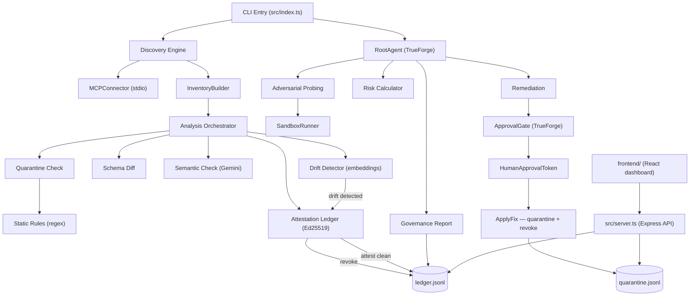

# 🛡️ Odezzy AI — MCP Security Red-Teaming Agent

> **Discovers, probes, and cryptographically attests every MCP tool your AI agents can reach — and won't remediate a single one without a human approving it first, in a way that can't be faked.**

[](https://www.typescriptlang.org/)
[](https://nodejs.org/)
[](https://truefoundry.com/trueforge)
[](.github/workflows/ci.yml)

AI agents connected through MCP (Model Context Protocol) trust the tools they're given completely — including the plain-English description each tool ships with. Nothing stops a tool from lying about what it does, hiding an instruction inside that description, or quietly changing its behavior after your agent has already learned to trust it.

Odezzy AI closes that gap. It discovers every MCP server and tool an agent can reach, runs four independent checks against each one, and — for tools that pass clean — issues a cryptographically signed attestation that's automatically revoked the moment a tool's behavior drifts. When a fix needs applying, it can only happen after a real human approves it through TrueForge, enforced by a type the compiler itself won't let any other code path fake.

---

## ✨ What it actually does

- **4-Pass Analysis Pipeline** — static regex rules → schema diff → Gemini semantic review → embedding-based drift detection
- **Adversarial Probing** — deterministic probes run against every discovered tool (undeclared parameters, prompt injection, secret leakage, schema mismatch)
- **Cryptographic Attestation Ledger** — Ed25519-signed, hash-chained records; a tool's attestation is automatically revoked in the same ledger the moment drift detection catches it changing meaning
- **Shadow Server Detection** — flags MCP servers Odezzy can see in your config that TrueForge doesn't have registered
- **Quarantine Registry** — its own hash-chained log (built on the same shared primitive as the attestation ledger), so a banned tool's history is just as tamper-evident as a trusted one's
- **Human-Gated Remediation** — a `HumanApprovalToken` type with a private constructor: the only way to get one is through a genuine TrueForge approval, a `--confirm` CLI flag typed by a human, or a TrueForge-gated tool call actually executing. No code path anywhere in the system can construct one any other way.
- **Full Dashboard** (`frontend/`) — a real React app with live Overview, Scans, Findings, Servers, Attestation, Quarantine, Reports, and Logs pages, backed by `src/server.ts`'s API. Falls back to clearly-labeled sample data (never silently) if the API isn't running.
- **Governance Reports** — Markdown + JSON reports with the full attestation ledger and public verification key included

---

## 🏗️ Architecture



---

## 🚀 Quick Start

### Prerequisites
- Node.js ≥ 18
- A [Gemini API key](https://aistudio.google.com/apikey) (semantic analysis + drift detection)
- [TrueForge](https://truefoundry.com/trueforge) (required for `fullscan`'s approval-gated remediation — `scan` works without it)

### Installation

```bash
git clone https://github.com/dharshansri2007/Odezzy-Ai.git
cd Odezzy-Ai
npm install
```

### Configuration

Create a `.env` in the project root:

```
GEMINI_API_KEY=your-gemini-api-key
GCP_PROJECT_ID=your-project-id
TRUEFORGE_URL=http://localhost:8790
TRUEFORGE_API_KEY=            # optional — not required in TrueForge's local single-user mode
TRUEFORGE_MODEL=              # optional — provider/model string, see "Choosing a TrueForge model" below
REMEDIATION_MCP_SERVER_NAME=  # the name you register the remediation server under in TrueForge (see below)
```

Edit `odezzy.config.json` to point at the MCP servers you want scanned:

```json
{
  "servers": [
    {
      "name": "my-mcp-server",
      "command": "npx",
      "args": ["tsx", "path/to/server.ts"]
    }
  ]
}
```

### Running

```bash
# Quick scan — static + schema + semantic + drift, no TrueForge required
npm run scan

# Full scan — adds adversarial probing + TrueForge-gated remediation
npm run fullscan

# Start the API server the dashboard reads from
npm run api

# Start the remediation MCP server (needs to be running for fullscan's
# approval flow to actually reach TrueForge — see setup below)
npm run remediation-server

# Run against the built-in vulnerable canary server
npm run canary   # in one terminal
npm run scan     # in another

# Dashboard (separate terminal)
cd frontend && npm install && npm run dev
```

---

## ⚙️ TrueForge Setup (required for `fullscan`'s remediation to actually run)

`fullscan` works without this — it just fails closed on every remediation proposal (everything gets treated as rejected, nothing is silently applied). To let a human genuinely approve something:

1. Run the remediation server: `npm run remediation-server`. It listens over **Streamable HTTP**, not stdio — TrueForge's own "Add MCP Server" UI only accepts a URL, not a launch command, which is why this isn't a stdio server.
2. Make that port reachable from wherever TrueForge itself runs. If TrueForge is remote (e.g. a cloud dev environment), `localhost` from your machine is **not** the same `localhost` TrueForge sees — use your environment's port-forwarding/preview URL feature and give TrueForge *that* URL.
3. In TrueForge → **Settings → Connectors → Add MCP Server**: give it a name, point the URL at `http://<reachable-host>:8791/mcp`, Auth type `None`.
4. Set `requireApprovalForTools: ["@all"]` on that connector. This is the actual enforcement mechanism — TrueForge will now refuse to call the remediation tool until a human approves it in TrueForge's own UI.
5. Put that connector's name in `.env` as `REMEDIATION_MCP_SERVER_NAME`.
6. Run `npm run fullscan`.

**Choosing a TrueForge model:** not every model works cleanly with TrueForge's turn-replay logic. Reasoning-capable models (e.g. GPT-OSS variants) emit a `reasoning_content` field that some providers reject when it's replayed back to them as conversation history on the next turn — this is a TrueForge/provider interop issue, not something Odezzy's code can work around. If you hit a `reasoning_content is unsupported` error, switch `TRUEFORGE_MODEL` to a non-reasoning chat model instead.

**A currently-unauthenticated endpoint, stated plainly:** the remediation server's HTTP endpoint has no bearer-token check of its own yet (unlike `src/server.ts`'s `/api/approvals/resolve`, which does). This is safe as long as nothing but TrueForge can reach the port — don't expose it beyond a private/internal network without adding that check first.

---

## 🔏 Cryptographic Attestation Ledger

1. After all analysis passes complete, tools with zero open findings receive an Ed25519-signed attestation record
2. Records are hash-chained — each one references the SHA-256 of the record before it, using a shared `HashChainedLog` primitive (`src/utils/hash-chained-log.ts`) that also backs the quarantine registry, so both logs get the same tamper-evidence guarantee, not two different ones
3. If drift detection later catches a previously-trusted tool changing meaning, its attestation is explicitly revoked in the same ledger — and the check happens again, independently, immediately before signing, so a tool quarantined mid-scan by a concurrent process can't slip through
4. The public key ships in governance reports so the chain is independently verifiable — you don't have to trust Odezzy's runtime output, only the math

```
.odezzy/attestation/
├── keys.json        # Ed25519 keypair (auto-generated on first run)
└── ledger.jsonl     # Append-only hash-chained attestation log

.odezzy/
└── quarantine.jsonl # Same hash-chain pattern, for banned tools
```

---

## 🔐 Why a fix can't be faked

The naive way to gate a dangerous action is a boolean: `approved: true`. The problem is that a boolean is just data — any code path, anywhere, present or future, could construct one.

`HumanApprovalToken` (`src/remediation/human-approval-token.ts`) has a private constructor. The only way to get an instance is through one of its factory methods, each tied to one real, verifiable approval source:
- `fromTrueForgeResolution` — a human resolved a pending approval in TrueForge's UI (throws if the resolution was a denial)
- `fromCliConfirmFlag` — a human typed `--confirm` at their own terminal
- `fromTrueForgeGatedToolCall` — the remediation server's handler is running at all, which is only possible because TrueForge itself paused and got human approval before ever calling it

`ApplyFix.apply()` requires one of these tokens as a parameter, and cross-checks the token's finding ID against the finding actually being acted on — so even a genuine token can't be replayed to approve a different action than the one a human reviewed. No amount of refactoring elsewhere in the codebase can route around this; the compiler won't allow it.

---

## 🧪 Testing

```bash
npm test                                          # full suite
npx vitest run tests/human-approval-token.test.ts # one suite
npx vitest run --coverage
```

| Suite | Covers |
|---|---|
| `types.test.ts` | Zod schema validation |
| `analysis.test.ts` | Static rules + schema diff |
| `drift-detector.test.ts` | Embedding drift detection |
| `probing.test.ts` | Probe templates + normalizer |
| `scoring.test.ts` | Risk formulas + classification |
| `canary.test.ts` | Integration against the canary server |
| `agent.test.ts` | RootAgent lifecycle |
| `config.test.ts` | Config parsing + defaults |
| `attestation.test.ts` | Ledger: attest, verify, revoke, chain |
| `quarantine.test.ts` | Quarantine hash-chain, TOCTOU-safe attestation, approval-gated apply |
| `human-approval-token.test.ts` | All three factories + cross-finding rejection |
| `remediation-server.test.ts` | Real MCP subprocess exercising `apply_fix` |
| `server-approvals.test.ts` | HTTP API approval endpoints |

---

## 🚦 Build Health — what's actually enforced

It's easy for "security review" on a project like this to quietly mean "an AI left some comments," which isn't the same as "this bug cannot merge." Here's exactly which is which.

**Enforced automatically, blocks the PR** (`.github/workflows/ci.yml`):
- `npm run typecheck` (`tsc --noEmit`)
- `npm test` (the full suite above)
- A grep-based check that any file calling `ApplyFix.apply()` also imports `HumanApprovalToken`

**Available, opt-in, not yet CI-enforced:**
- `.githooks/pre-commit` runs the same typecheck locally before a commit happens. Enable once per clone: `git config core.hooksPath .githooks`.

**Advisory only, does not block anything** (`pr_agent.toml`):
- Qodo's automated PR review — useful for logic questions and edge cases a compiler can't catch, but comments can be left unaddressed and the PR still merges.

**Manual, human judgment only:**
- Whether a specific proposed remediation is actually safe to approve — that's the entire point of the approval gate, not something CI can replace.
- Ed25519 key custody (`.odezzy/attestation/keys.json`) — nothing automated rotates or protects this file today.

---

## 📁 Project Structure

```
Odezzy-Ai/
├── src/
│   ├── attestation/attestation-ledger.ts   # Ed25519 sign/verify/revoke, hash-chained
│   ├── analysis/
│   │   ├── index.ts                        # Orchestrator — quarantine check → static → schema → semantic → drift → attest
│   │   ├── static-rules.ts / secret-patterns.ts
│   │   ├── schema-diff.ts
│   │   ├── semantic-check.ts               # Gemini 2.5 Flash, schema-validated output, fails safe
│   │   └── drift-detector.ts               # Embedding-based drift, cosine distance
│   ├── agent/
│   │   ├── root-agent.ts                   # Full pipeline orchestrator
│   │   ├── subagent.ts                     # Adversarial probe fan-out
│   │   └── trueforge-client.ts             # SDK wrapper — sessions, turns, approvals
│   ├── discovery/                          # MCP connection, inventory, shadow-server detection
│   ├── probing/                            # Deterministic adversarial probe templates + sandbox runner
│   ├── scoring/                            # Weighted risk formula + A–F classification
│   ├── remediation/
│   │   ├── human-approval-token.ts         # The type that makes fake approval uncompilable
│   │   ├── approval-gate.ts                # TrueForge approval flow, mints tokens on real resolution
│   │   ├── apply-fix.ts                    # Requires a token; quarantines + revokes attestation
│   │   ├── quarantine-registry.ts          # Hash-chained ban list
│   │   └── fix-proposer.ts
│   ├── report/                             # Markdown + JSON governance reports, graph data
│   ├── persistence/                        # Session store (redacts secrets before disk write), drift baselines
│   ├── utils/hash-chained-log.ts           # Shared primitive behind both ledgers
│   ├── server.ts                           # Express API for the dashboard, bearer-auth on mutating routes
│   └── index.ts                            # CLI entry point
├── remediation-server/server.ts            # Streamable HTTP MCP server — the actual TrueForge approval target
├── frontend/                               # React dashboard (Overview, Scans, Findings, Attestation, Quarantine, Reports, Logs)
├── canary-server/                          # Deliberately vulnerable test target
├── tests/
├── .github/workflows/ci.yml
└── .githooks/pre-commit
```

---

## 🗺️ OWASP MCP Top 10 Coverage

| OWASP Category | Detection Method |
|---|---|
| MCP01:2025 – Token Mismanagement | Static regex (`sk_live_`, `ghp_`, `AIza`, shared with `secret-patterns.ts`) |
| MCP03:2025 – Tool Poisoning | Static regex + Gemini semantic review + embedding drift |
| MCP05:2025 – Command Injection | Schema diff + runtime probe (undeclared parameters) |
| MCP06:2025 – Prompt Injection | Static regex + Gemini semantic review |

---

## 📜 License

MIT
